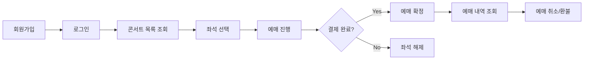

# 콘서트 예약 시스템 백엔드 개발자 과제

## 📋 과제 개요

**"CONCERT MANIA"** - 대용량 트래픽을 처리하는 콘서트 티켓 예약 플랫폼의 백엔드 시스템을 개발합니다.

실제 콘서트 예약 서비스에서 발생하는 **대용량 동시 접속, 좌석 선점 경쟁, 결제 시간 제한** 등의 복잡한 비즈니스 시나리오를 Spring Boot 기반으로 구현하여, 실무에서 요구되는 백엔드 개발 역량을 종합적으로 평가합니다.

---

## 🎯 핵심 비즈니스 시나리오

### 사용자 여정 (User Journey)

### 핵심 도전 과제

- 🔥 **인기 콘서트 예매 오픈**: 수천 명이 동시에 같은 좌석을 선택하는 상황
- ⏰ **시간 제한 예매**: 좌석 선택 후 10분 내 결제 완료 필수
- 🪑 **좌석 정합성**: 동일 좌석 중복 예매 절대 불가
- 💳 **결제 연동**: 외부 결제 API 호출 및 실패 처리

---

## 🏗️ 시스템 아키텍처 요구사항

### 주요 구현 기능

#### 1. 인증 및 사용자 관리 🔐

- **회원가입/로그인**
- **권한 기반 접근 제어** (일반 사용자 vs 관리자)

#### 2. 콘서트 및 좌석 관리 🎪

- **콘서트 정보 관리** (제목, 날짜, 장소, 가격)
- **좌석 배치도 및 등급별 가격 설정**
- **예매 오픈/마감 시간 관리**

#### 3. 예매 핵심 로직 🎫

- **실시간 좌석 상태 조회** (예매 가능/선택됨/예매완료)
- **좌석 임시 점유** (10분 타이머)
- **동시성 제어를 통한 좌석 선점 처리**
- **결제 완료 시 예매 확정**

#### 4. 대기열 시스템 ⏳

- **예매 오픈 전 대기열 등록**
- **순차적 입장 처리**
- **대기 순번 및 예상 시간 안내**

#### 5. 결제 시스템 💰

- **외부 결제 API 모킹** (PG사 연동 시뮬레이션)
- **결제 상태 관리** (진행중/완료/실패/취소)
- **결제 실패 시 좌석 자동 해제**

#### 6. 모니터링 및 관찰성 📊

- **애플리케이션 메트릭**
- **구조화된 로깅**
- **주요 비즈니스 이벤트 로깅** (예매 성공/실패, 결제 완료 등)

#### 7. 이벤트 기반 아키텍처 📡

- **예매 완료 시 이메일/SMS 알림** (비동기 처리)
- **도메인 이벤트 발행** (Spring Events 또는 메시징)
- **이벤트 소싱 패턴** 적용 고려

#### 8. 성능 최적화 ⚡

- **캐싱 시스템** (콘서트 정보, 좌석 상태)
- **DB 인덱싱 최적화**
- **N+1 쿼리 문제 해결**
- **커넥션 풀 튜닝**

#### 9. 부하 테스트 및 분석 🧪

- **부하 테스트 시나리오** (JMeter/K6 등 활용)
- **TPS 측정 및 병목 지점 분석**
- **동시 사용자 처리 성능 검증**

---

## 🛠️ 기술 스택 요구사항

### 필수 기술

- **Framework**: Spring Boot (3.x 버전 권장)
- **ORM**: Spring Data JPA
- **Language**: Java 또는 Kotlin

### 자유 선택 기술

- **Database**: MySQL, PostgreSQL, H2 등
- **Caching**: Redis, Caffeine, EhCache 등
- **Messaging**: RabbitMQ, Kafka, Spring Events 등
- **Testing**: JUnit 5, TestContainers, MockMvc 등
- **Monitoring**: Micrometer, Actuator, Prometheus 등

### 인프라 요구사항

- **컨테이너화**: Docker + Docker Compose 필수
- **API 문서화**: Swagger/OpenAPI 3.0 필수
- **환경 설정**: 개발/테스트 환경 분리

---
